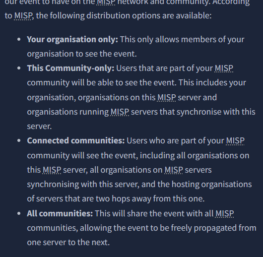
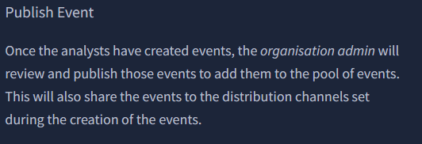
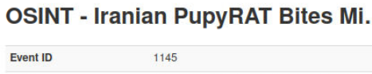
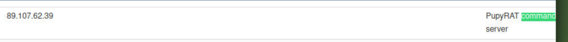

# SOC1: MISP

## TASK1: ROOM OVERVIEW
MISP - MALWARE INFORMATION SHARING PLATFORM 
(Nền tảng chia sẻ thông tin về phần mềm đọc hại)

Mục tiêu của phòng này:
- Giới thiệu về MISP và lý do phát triển MISP.
- Các trường hợp sử dụng MISP có thể được áp dụng cho
- Các tính năng và thuật ngữ cốt lõi.
- Điều hướng bảng điều khiển.
- Tạo và quản lý sự kiện.
- Nguồn cấp dữ liệu và phân loại.

## TASK2: INTRO MISP: Features & Terminologies
MISP là gì?
MISP là nền tảng mã nguồn mở giúp thu thập, lưu trữ và chia sẻ thông tin tình báo về mối đe dọa và IOCs (chỉ số thỏa hiệp) liên quan đến mã độc, tấn công mạng, gian lận tài chính, v.v., trong các cộng đồng đáng tin cậy. Nền tảng hỗ trợ chia sẻ thông tin theo mô hình phân tán (kín, bán riêng tư, công khai) và tích hợp với các hệ thống như NIDS, SIEM.

Chức năng chính:

Lưu trữ và quản lý IOCs.
Tương quan tự động để tìm mối liên hệ giữa các chỉ số.
Chia sẻ dữ liệu qua nhiều mô hình và tích hợp với hệ thống khác.
Nhập/xuất sự kiện, hỗ trợ API và biểu đồ hóa mối quan hệ.
Ứng dụng: Phân tích mã độc, điều tra bảo mật, phân tích tình báo, thực thi pháp luật, phân tích rủi ro và gian lận tài chính.

Thuật ngữ quan trọng: Sự kiện, thuộc tính, đối tượng, quan sát, thẻ, phân loại, galaxies, chỉ số.

## TASK3: USING THE SYSTEM

*How many distribution options does MISP provide to share threat information?*

**Answer: 4**
 

*Which user has the role to publish events?*

**Answer: Organisation Admin**

## TASK4: FEEDS AND TAXONOMIESTAXONOMIES
Nguồn cấp dữ liệu (Feeds): Tài nguyên chứa chỉ số nhập vào MISP, cung cấp thông tin cập nhật về mối đe dọa, hỗ trợ trao đổi, xem trước, nhập sự kiện và tương quan thuộc tính. Được quản lý bởi Quản trị viên Trang.

Phân loại (Taxonomies): Phương pháp phân loại sự kiện, chỉ số, tác nhân đe dọa bằng thẻ máy (machine tags) gồm Namespace, Predicate, Value. Giúp xử lý sự kiện, xuất IDS và đảm bảo phân loại chính xác.

Gắn thẻ (Tagging): Gắn thẻ vào sự kiện/thuộc tính để xác định và chia sẻ thông tin mối đe dọa. Hỗ trợ thẻ toàn cầu, cục bộ và thẻ tùy chỉnh. Nên gắn thẻ ở cấp sự kiện, chỉ gắn thuộc tính khi là ngoại lệ.

Thực hành tốt nhất: Sử dụng bộ thẻ tối thiểu (Traffic Light Protocol, Confidence, Origin, Permissible Actions Protocol) để đảm bảo sự kiện rõ ràng, dễ phân phối.

## TASK5: SCENARIO EVENTEVENT

Scenario: CIRCL(Computer Incident Respons Center Luxembourg) đã công bố một sự kiện liên quan đến PupyRAT. Tổ chức của bạn đang trong tình trạng báo động về trojan truy cập từ xa và phần mềm độc hại trong tự nhiên và ban đang được giao nhiệm vụ điều tra sự kiện này và đối chiếu các chi tiết với SIEM của bạn.

*What event ID has been assigned to the PupyRAT event?*

**Answer:1145**

*The event is associated with the adversary gaining ______ into organisations.*

**Answer: Remote Access**

RAT là Remote Access Trojan nên ta có thể xác định phần còn thiếu ở đây. Đặc biệt trong phần tag "RemoteAccess".

*What IP address has been mapped as the PupyRAT C2 Server*

**Answer: 89.107.62.39**

Sử dụng Ctrl + F để tìm kiếm Command thì nhận được kết đáp án.

*From the Intrusion Set Galaxy, what attack group is known to use this form of attack?*

**Answer: Magic Hound**

Ta có thể thấy luôn ttong phần tag misp-galaxy...intrusion-set="Magic Hound".

*There is a taxonomy tag set with a Certainty level of 50. Which one is it?*

**Answer: OSINT**

Từ phần tag trong ảnh có thể thấy luôn đó là OSINT.

 