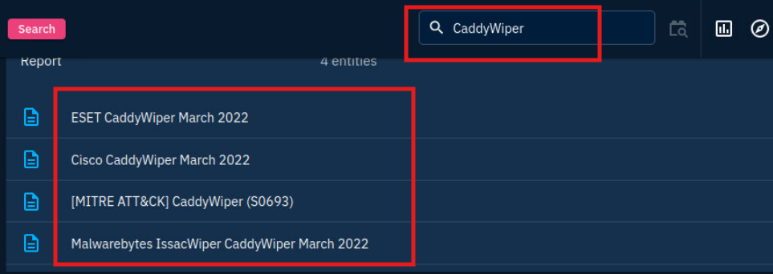

# SOC1: OpenCTI

## TASK1: ROOM OVERVIEW

Phòng này sẽ đề cập đến các khái niệm và cách sử dụng OpenCTI, một nền tảng tình báo mối đe dọa nguồn mở. Phòng này sẽ giúp bạn hiểu và trả lời các câu hỏi sau:

- OpenCTI là gì và nó được sử dụng như thế nào?
- CóCó thể điều hướng qua nền tảng này như thế nào?
- Những chức năng nào sẽ quan trọng trong quá trình phân tích mối đe dọa an ninh?

## TASK2: Intro OpenCTI

Cyber Threat Intelligence (CTI) là một thách thức quản lý khi các tổ chức cố gắng nhập, phân tích và trình bày dữ liệu mối đe dọa. OpenCTI, một nền tảng mã nguồn mở do ANSSI phát triển, giúp quản lý CTI bằng cách lưu trữ, phân tích, trực quan hóa và trình bày các chiến dịch đe dọa, mã độc và IOCs. Mục tiêu là khai thác thông tin kỹ thuật/phi kỹ thuật, xây dựng mối liên hệ với nguồn gốc, sử dụng khung MITRE ATT&CK và tích hợp với các công cụ như MISP và TheHive.

## TASK3: OpenCTI DATA MODEL
OpenCTI sử dụng tiêu chuẩn STIX2 để cấu trúc dữ liệu, cho phép biểu diễn dữ liệu dưới dạng thực thể và mối quan hệ, giúp truy xuất nguồn gốc thông tin. Kiến trúc của nền tảng hỗ trợ mô hình này thông qua:

- GraphQL API: Kết nối ứng dụng khách với cơ sở dữ liệu và hệ thống tin nhắn.
- Write workers: Tiến trình Python xử lý truy vấn ghi không đồng bộ qua RabbitMQ.
- Connectors: Tiến trình Python nhập, làm giàu, xuất dữ liệu, tạo mạng lưới tích hợp để xây dựng tình báo mối đe dọa và cải thiện phòng thủ.

Connectors trong OpenCTI hỗ trợ nhập, làm giàu, và xuất dữ liệu:

- External Input: Lấy dữ liệu từ nguồn bên ngoài (CVE, MISP, TheHive, MITRE).
- Stream: Xử lý luồng dữ liệu nền tảng (History, Tanium).
- Internal Enrichment: Làm giàu thực thể từ yêu cầu người dùng (Observables).
- Internal Import File: Trích xuất từ báo cáo tải lên (PDF, STIX2).
- Internal Export File: Xuất dữ liệu sang các định dạng như CSV, STIX2, PDF.

## TASK4: OpenCTI Dashboard 1

Bảng điều khiển OpenCTI: Tóm tắt dữ liệu mối đe dọa qua tiện ích (tổng thực thể, báo cáo, quan sát, thay đổi 24h).

Activities: Báo cáo sự cố bảo mật để điều tra.

Knowledge: Dữ liệu về công cụ, nạn nhân, tác nhân đe dọa, chiến dịch.

Analysis: Trích xuất tri thức từ báo cáo, thêm ghi chú/tài nguyên.

Events: Ghi lại phát hiện, liên kết sự cố.

Observations: Yếu tố kỹ thuật, hiện vật để ánh xạ/tương quan mối đe dọa.

Threats: Tác nhân đe dọa, bộ xâm nhập (APT), chiến dịch tấn công.

Arsenal: Mã độc (4H RAT), TTPs, công cụ (CMD), lỗ hổng (CVE), hành động đối phó.

Entities: Phân loại lĩnh vực, quốc gia, tổ chức, cá nhân để làm giàu tri thức.

*What is the name of the group that uses the 4H RAT malware?*

**Answer: Putter Panda**

Chọn vào mục Arsenal tìm kiếm 4HRAT, trong phần Description ta nhận dược đáp án.

*What kill-chain phase is linked with the Command-Line Interface Attack Pattern?*

**Answer: Execution-ics**

*Trong Arsenal chọn vào mục Attack Pattern sau đó tìm kiếm Command-Line Interface, chọn vào để xem thông tin.*

Within the Activities category, which tab would house the Indicators?

**Answer: Observations**

## TASK5: OpenCTI Dashboard 2
General Tabs Navigation trong OpenCTI hỗ trợ phân tích mối đe dọa (ví dụ: Cobalt Strike trong tab Arsenal):

Overview: Thông tin tổng quan (ID, mức tin cậy, mô tả, mối quan hệ, báo cáo, tham chiếu).
Knowledge: Thông tin liên kết (báo cáo, chỉ số, dòng thời gian tấn công, chi tiết mối đe dọa/sự kiện).
Analysis: Báo cáo liên quan, hỗ trợ điều tra.
Indicators: Chỉ số Thỏa hiệp (IOC).
Data: Tệp tải lên/xuất để truyền đạt thông tin.
History: Theo dõi thay đổi thực thể/thuộc tính/mối quan hệ.

*What Intrusion sets are associated with the Cobalt Strike malware with a Good confidence level? (Intrusion1, Intrusion2)*

**Answer: CopyKittens, FIN7**

Chọn tab Arsenal tìm kiếm Cobalt Strike, vào phần Knowledge chọn mục Intrusion sets tìm kiếm "GOOD" confidence level 

*Who is the author of the entity?*

**Answer:The MITRE Corporation**

# TASK6: Investigative Scenario

Với tư cách là một nhà phân tích SOC , bạn được giao nhiệm vụ điều tra về phần mềm độc hại và các nhóm APT đang hoành hành trên toàn thế giới. Nhiệm vụ của bạn là điều tra phần  mềm độc hại CaddyWiper  và  nhóm APT37.

*What is the earliest date recorded related to CaddyWiper?  Format: YYYY/MM/DD*

**Answer: 2022/03/15**

Ngày sớm nhất ghi nhậnnhận

*Which Attack technique is used by the malware for execution?*

**Native API**

Trong Tab Knowledge

*How many malware relations are linked to this Attack technique??*

**113**

*Which 3 tools were used by the Attack Technique in 2016? (Ans: Tool1, Tool2, Tool3)*

**BloodHound, Empire, ShimRatReporter**

*What country is APT37 associated with?*

**North Korea**

*Which Attack techniques are used by the group for initial access? (Ans: Technique1, Technique2)*

**T1189, T1566**