# SOC1: WireShark: Traffic Analysis

## TASK1: Introduction

## TASK2: Nmap Scan

Use the "Desktop/exercise-pcaps/nmap/Exercise.pcapng" file.
What is the total number of the "TCP Connect" scans?

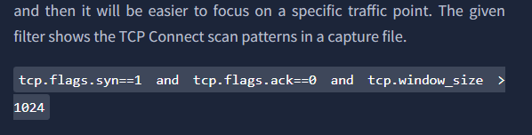

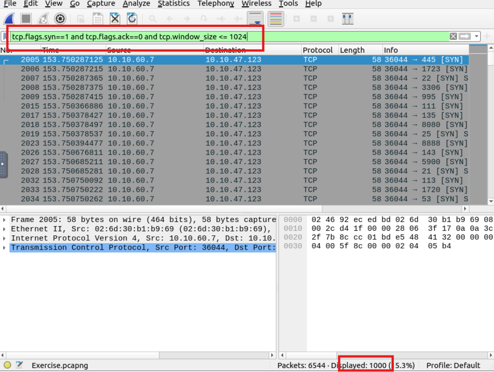

Ngay trong phần tóm tắt TCP connect.

**Answer: 1000**

Which scan type is used to scan the TCP port 80?

**Answer: TCP Connect**

How many "UDP close port" messages are there?

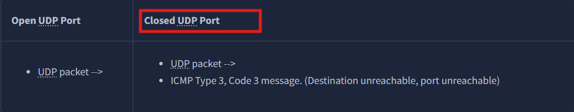
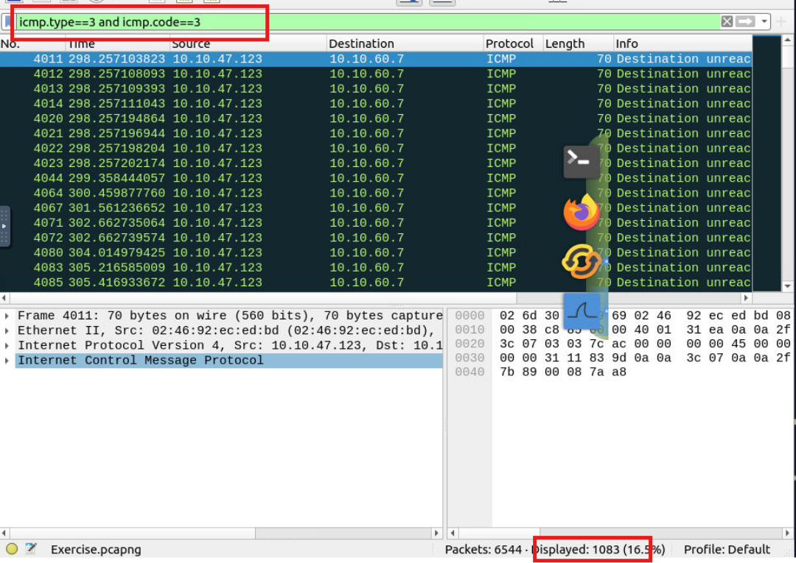

Trong phần tóm tắt tôi đọc được cách lọc UDP close port.

**Answer: 1083**

Which UDP port in the 55-70 port range is open?

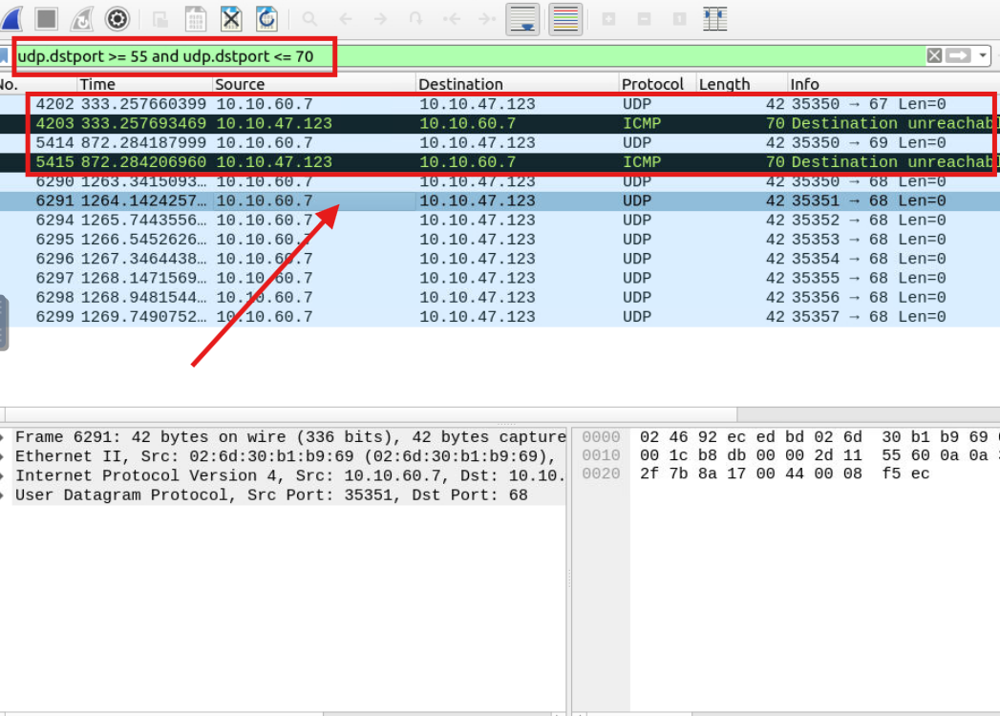

Sau khi lọc các gói tin có cổng địch từ 55-70 tôi nhận được 3 cổng 67, 69, 68 tuy nhiên 2 cổng 67, 69 bị từ chối.
Gói tiếp theo: ICMP "Destination unreachable (Port unreachable)" từ 10.10.47.123
Kết quả chỉ có cổng 68 có thể truy cập. 

**Answer: 68**

## TASK3: ARP Poisoning & Man In The Middle!

Use the "Desktop/exercise-pcaps/arp/Exercise.pcapng" file.
What is the number of ARP requests crafted by the attacker?

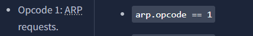

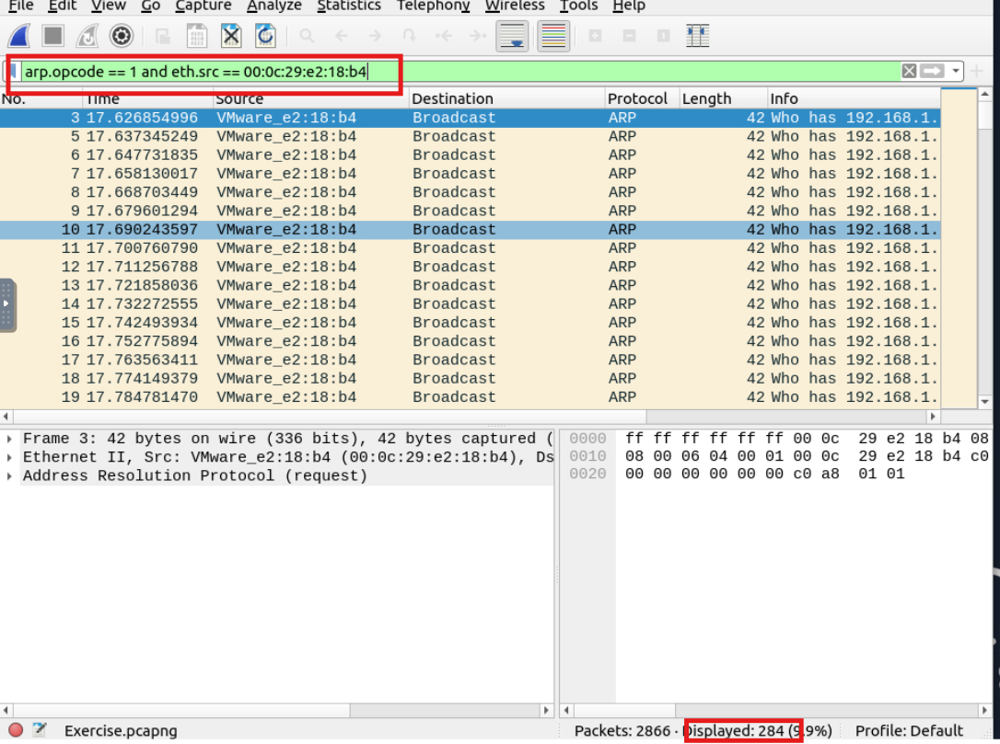

Ở đây yêu cầu tìm số gói tin req tới từ attacker nên tôi sẽ lọc gói arp request và địa chỉ MAC nguồn của kẻ tấn công.

**Answer: 284**

What is the number of HTTP packets received by the attacker?

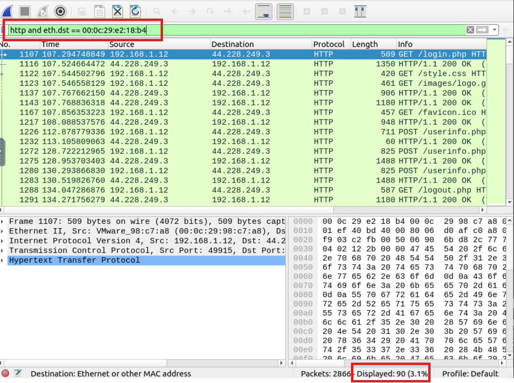

Đề yêu cầu ta tìm số gói tin HTTP mà attacker nhận được. Tôi lọc các gói http kết hợp với địa chỉ đích là địa chỉ MAC của kẻ tấn công.

**Answer: 90**

What is the number of sniffed username&password entries?

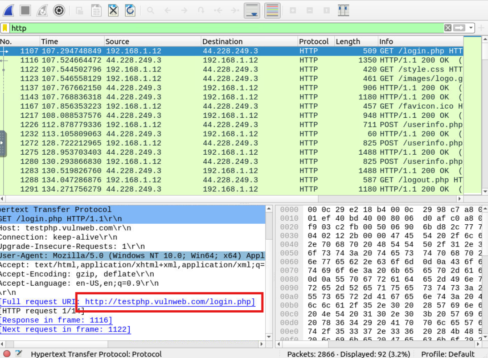
Ban đầu tôi lọc các gói HTTP và đọc Phần Pane Detail quan sát thấy một đường dẫn URI

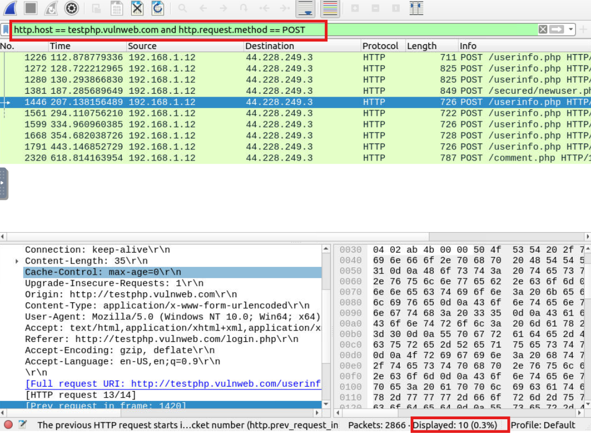
Lọc theo miền của đường dẫn vừa nhận được tôi nhận được 10 gói tin.Kiểm tra từng gói

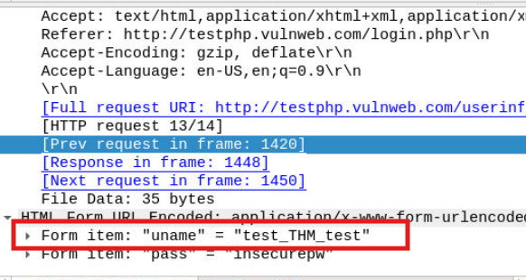
Quan sát các gói tin đọc phần Pane Detail tôi thấy một số gói có item và pass.

Thêm thêm "uname" vào bộ lọc thì chỉ còn 7 gói tin nhưng vẫn chưa đúng.

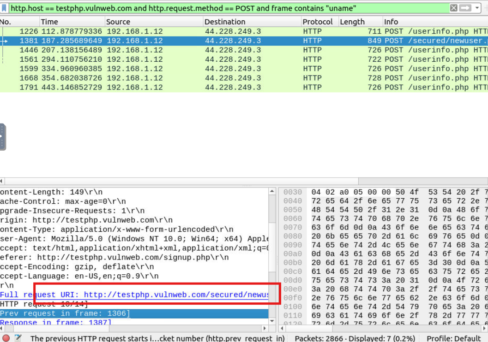
Kiểm tra các gói tin thì tôi phát hiện trong phần Full request URI có một gói có đường dẫn khác với 6 gói còn lại.Suy ra có 6 user bị đánh cắp tài khoản và mật khẩu. 

**Answer: 6**

What is the password of the "Client986"?
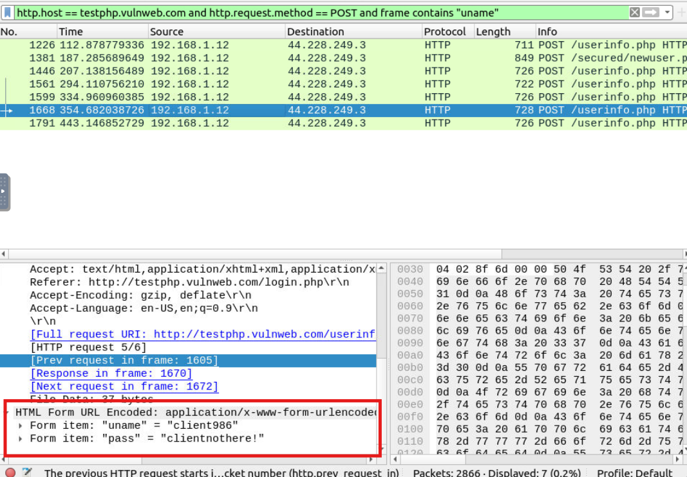
Kiểm tra Pane Detail của các gói tin 

**Answer: clientnothere!**

What is the comment provided by the "Client354"?
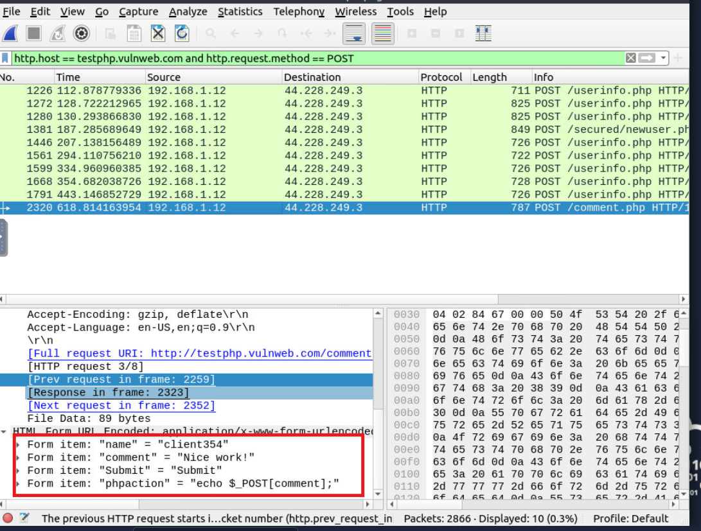

Trong 6 người dùng bị hack thì không tồn tại Client354 nên tôi đã bỏ bớt phần "uname" kiểm tra 10 gói tin thì thấy Client354.

**Answer: Nice work!**

